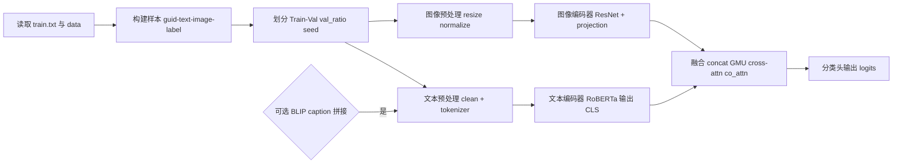
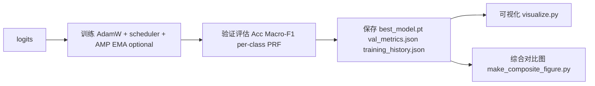
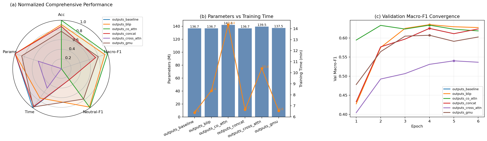

# 实验五：多模态情感分类实验报告
GitHub 仓库：<https://github.com/irani0811/-lab5>
## 1. 实验任务概述
- 目标：输入配对的文本与图像，输出情感标签（positive / neutral / negative）。
- 数据来源：`train.txt`、`test_without_label.txt` 与 `data/` 目录下的 guid 文件。

## 2. 数据集与预处理
- `train.txt`：约 5k 样本，包含 guid 与标签。
- `data/`：每个 guid 对应一条英文短文本与一张图片。
- 注意：`data/` 目录内存在少量冗余文件，训练与评估时以 `train.txt` / `test_without_label.txt` 中提供的 guid（以及训练标签）为准。
- 预处理策略：
  - 文本：使用 HuggingFace `roberta-base` tokenizer（RoBERTa[2]），最长 128 token，空文本回退到 `[PAD]`；支持仅微调最后 N 层。
  - 图像：统一 Resize 到 224×224，并按 ImageNet 均值/方差归一化；训练可启用 RandAug 风格增强（RandomResizedCrop、ColorJitter、GaussianBlur）。
  - 训练阶段按照要求，从训练集划分 20% 作为验证集（`--val-ratio` 可调），并可选对 neutral 类过采样及类别均衡采样。

## 3. 模型与训练流程

本项目的训练流程围绕“**文本编码 + 图像编码 + 融合分类**”展开。文本侧采用 `roberta-base`（RoBERTa[2]）提取句级语义表示，并支持通过 `--text-train-layers` **仅微调最后 N 层**以提高稳定性并降低过拟合风险。图像侧使用 ImageNet 预训练的 `ResNet18/ResNet50`（ResNet[3]）提取视觉特征，再通过线性层映射到统一的嵌入维度（默认 256），从而与文本表示在同一特征空间内交互。为提升鲁棒性，我加入了**模态 Dropout**，在训练时随机屏蔽单一模态，使模型学会在图像或文本缺失/噪声时仍保持可用的判别能力。

在融合模块上，我分别实现了**简单拼接**、**门控融合（GMU[1]）**、**跨注意力**与**双向协同注意力**。其中 **co_attn** 允许文本与图像互相检索关键线索后再进行融合，旨在缓解图文不一致或信息不足造成的误判。优化方面统一使用 **AdamW[6]（lr=2e-5）**，并结合**梯度累积**（`--grad-accum-steps`）、**Warmup+Cosine** 调度、**AMP**、**EMA**、**标签平滑**、**R-Drop[5]** 等策略，保证训练稳定并提升泛化。

整体流程如图所示：

## 4. 结果与可视化

### 4.0 对比实验设置思路（变量控制与评价口径）

本实验的核心目标是验证“更强的融合模块”与“用生成式 caption 显式注入图像语义”是否能提升多模态情感分类效果。为了保证对比结论可信，实验设计遵循以下原则：

1. **控制变量**
   - 在每组对比中仅改变一个因素（例如只改 `fusion_method`，或只开/关 `use_caption`），其余训练超参保持一致。
   - 统一数据划分：固定 `seed=42`、`val_ratio=0.2`，确保验证集一致，避免由于随机划分造成的波动掩盖真实增益。

2. **两条对比主线**
   - **融合策略对比**：在同一 backbone（文本 `roberta-base` + 图像 `resnet18`）和同一训练配置下，对比 `concat / gmu / cross_attn / co_attn` 的效果差异。
   - **BLIP Caption 增强对比**：在相同 fusion下，仅额外拼接 `[文本] [SEP] [caption]`，检验 caption 是否能改善困难类（尤其 neutral）的可分性。

3. **统一训练配置（保证可复现）**
   - 优化器与学习率：AdamW，lr=2e-5；训练轮数默认 6 epoch（各实验一致）。
   - 输出产物：每次训练均保存 `training_history.json`（逐 epoch 曲线）与 `val_metrics.json`（最佳模型的分类报告），并可用 `visualize.py` 生成曲线/混淆矩阵。

4. **评价指标与“best”的口径**
   - 报告同时关注 **Val Acc** 与 **Macro-F1**：Acc 反映总体正确率，Macro-F1 更适合类别不均衡场景（neutral 为困难类）。
   - 训练脚本默认按 **Val Acc** 选择并保存 `best_model.pt`，因此 `val_metrics.json` 对应的是“按 Acc 最优 epoch”的指标；而收敛曲线来自 `training_history.json` 的逐 epoch 记录，二者口径不同属于正常现象。

### 4.1 融合策略对比（固定 seed=42, val_ratio=0.2）

本节在完全相同训练设置下，仅切换 `fusion_method`，对比不同融合结构对验证集表现的影响，作为后续分析的主对照结论。

| 配置（fusion_method） | Best Val Acc | Best Val Macro-F1 | Best Epoch |
|---|---:|---:|---:|
| Concat（baseline） | 0.7425 | 0.5972 | 3 |
| GMU | 0.7325 | 0.6049 | 3 |
| Cross-Attn | 0.6563 | 0.4926 | 2 |
| Co-Attn | **0.7550** | **0.6337** | 4 |

从表中可以看到，在保持训练设置一致（同一随机种子与验证划分比例）的前提下，**不同融合策略对最终性能影响显著**。其中，`co_attn` 在验证集**准确率**与 **Macro-F1** 上均达到本组实验的最高值，说明在图文信息需要互相“对齐”与“互补”的场景中，**双向协同注意力**能够更充分地挖掘跨模态关联，从而带来更稳定的增益。相比之下，`cross_attn` 的准确率与 Macro-F1 均明显偏低，反映出该结构在当前数据规模与训练轮数下**更难收敛**，存在训练不稳定或欠拟合的现象。

### 4.2 BLIP Caption 拼接增强对比（Concat baseline vs BLIP Caption）

本节保持融合方式为 `concat` 不变，仅引入 caption 拼接来检验“生成式语义注入”是否能在不改结构的情况下带来增益。

| 配置 | Best Val Acc | Best Val Macro-F1 | Best Epoch |
|---|---:|---:|---:|
| Baseline（不加 caption） | 0.7425 | 0.5972 | 3 |
| BLIP Caption（[文本] [SEP] [caption]） | **0.7463** | **0.6251** | 3 |

上表给出的结果表明，在融合方式固定为 `concat` 的情况下，**仅通过引入 BLIP 生成的图像 caption** 并与原文本进行拼接，就能带来一致的性能提升。尤其是 **Macro-F1** 的提升幅度更明显（约 **+0.028**），而准确率仅小幅增加（约 +0.004）。这意味着 caption 的收益并非来自对多数类样本的进一步“刷分”，而更可能来自对**难样本/少数类**的区分能力增强。换言之，caption 将图像中隐含的语义**显式转写为文本线索**，使文本编码器能更容易捕捉到与情感倾向相关的细粒度描述，从而改善整体的宏平均指标。

### 4.3 类别级别分析（Neutral 改进最明显）

本节从类别层面展开，重点观察 neutral 这一困难类的 Precision/Recall/F1 变化，用于解释宏平均指标的提升来源。

| 配置 | Neutral Precision | Neutral Recall | Neutral F1 |
|---|---:|---:|---:|
| Baseline | 0.4571 | 0.2078 | 0.2857 |
| BLIP Caption | 0.4528 | 0.3117 | 0.3692 |
| Co-Attn | 0.4127 | 0.3377 | 0.3714 |

上表进一步从类别角度解释了为什么 **Macro-F1** 会对方法改进更敏感。可以观察到，Baseline 在 **neutral** 类别上的**召回率**仅为 **0.2078**，说明模型在不确定样本上更倾向于将其归入 positive/negative，从而导致 neutral 被大量漏检。

引入 **BLIP caption** 后，neutral 的召回率提升到 **0.3117**，F1 也同步上升；而 `co_attn` 在 neutral 的召回率上进一步达到 **0.3377**。

综合来看，**caption 增强**与更强的**跨模态交互结构**都能在一定程度上缓解“neutral 难识别”的问题。其背后的直观解释是，neutral 往往缺少明显的情感词或强烈视觉线索，需要模型综合语境与图像细节判断“情感不显著”，因此当图像语义被**显式注入**或跨模态对齐更充分时，neutral 的区分难度会降低。

### 4.4 可视化产物（用于报告插图）

为了更直观地展示训练过程与**错误模式**，本项目为每个实验输出目录提供了自动可视化产物。

- (a) 的雷达图可以直观看到，各方法在 **Acc / Macro-F1 / Neutral-F1** 上呈现出不同的权衡关系，同时**训练时间**与**参数量**也对实际可用性产生影响。我在绘制时对五个维度进行了归一化，其中训练时间与参数量采用“**越小越好**”的反向归一化，因此面积越大代表综合表现越优。
- 图(b) 进一步给出了参数量与训练时间的量化对照：可以观察到**更复杂的融合结构通常伴随更高的训练成本**。
- 图(c) 则从收敛过程角度验证了性能差异并非偶然波动：多数方法在第 **3–5** 个 epoch 左右达到 **Macro-F1** 的相对峰值，随后趋于稳定或略有回落。综合这三幅子图，我可以在“**效果—效率**”两方面对模型做出更全面的取舍。

### 4.5 选择最佳 epoch 与最终最佳配置（基于验证集 Macro-F1）

说明：项目在训练时默认按 **验证准确率（Val Acc）** 保存 `best_model.pt`，因此 `val_metrics.json` 中记录的是“按 **Acc 最优 epoch**”的分类报告；而综合图(c)展示的是 `training_history.json` 中每一轮的 `val_macro_f1` 曲线。因此会出现“曲线峰值的 **Macro-F1** 高于 `val_metrics.json` 里 best_macro_f1”的情况，这是由于 **best 的选择口径不同**。

本报告最终的模型选择以 **Macro-F1 优先**（更适合类别不均衡，且能更好反映 neutral 类表现）为准，对每个实验从 `training_history.json` 中挑选 `val_macro_f1` 的峰值 epoch，汇总如下：

| 实验 | Val Acc 最优 epoch | Val Acc@best | Macro-F1 最优 epoch | Macro-F1@best |
|---|---:|---:|---:|---:|
| Concat baseline (`outputs_baseline`) | 3 | 0.7425 | 4 | 0.6252 |
| BLIP Caption (`outputs_blip`) | 3 | 0.7463 | 4 | 0.6350 |
| GMU (`outputs_gmu`) | 3 | 0.7325 | 4 | 0.6072 |
| Cross-Attn (`outputs_cross_attn`) | 2 | 0.6563 | 5 | 0.5402 |
| Co-Attn (`outputs_co_attn`) | 4 | 0.7550 | 4 | 0.6337 |

在上述对照中可以看到，不同方法的“Acc 最优 epoch”与“**Macro-F1 最优 epoch**”并不总是一致，尤其是在 **neutral 类较难**的情况下，Macro-F1 的峰值往往出现在准确率略低但类别更均衡的轮次。结合收敛曲线可以发现，多数方法在第 **4** 个 epoch 左右已达到 Macro-F1 的相对峰值，后续继续训练带来的收益很有限，甚至会出现轻微回落，这与**过拟合**或类别边界被进一步“压向多数类”的现象一致。因此，在当前设置（**6 epochs**，**seed=42**，**val_ratio=0.2**）下，我认为没有必要为了形式上的“跑更久”而增加训练轮数，更合理的策略是采用**早停思想**，直接选择峰值附近的 checkpoint。

综合准确率、**Macro-F1** 以及 **neutral 类**的改善情况，最终我将 `co_attn` 作为本次实验的**最优融合方案**。该方法不仅在验证集准确率上达到最高值，同时在 Macro-F1 上也保持在第一梯队，并且 neutral 的 **Recall/F1** 改善更为稳定。考虑到其峰值出现在 **epoch=4**，最终模型可直接使用训练脚本保存的 `outputs_co_attn/best_model.pt` 进行推理与提交。

### 4.6 消融实验（Text-only / Image-only）

根据要求，除多模态融合模型整体效果外，还需要验证**单一模态的贡献**，即分别只输入文本或只输入图像时模型在验证集上的表现。为此，我在训练脚本中加入了**消融开关**：当启用 `--ablate-image` 时**屏蔽图像模态（text-only）**，启用 `--ablate-text` 时**屏蔽文本模态（image-only）**。在对比实验设置上，我保持与主实验一致的**随机种子**与**验证划分比例**，并尽量使用相同训练超参，以保证消融结论能够反映“模态信息量”差异，而非其他因素的干扰。
消融结果建议以如下表格呈现：

| 设置 | Best Val Acc | Best Val Macro-F1 | Neutral F1 |
|---|---:|---:|---:|
| Text-only（仅文本） | 0.7275 | 0.5548 | 0.2245 |
| Image-only（仅图像） | 0.6700 | 0.4721 | 0.1935 |
| Multimodal（图像+文本，最佳配置） | 0.7550 | 0.6337 | 0.3714 |

从本次消融结果可以更清晰地看出两种模态各自的**贡献**与**局限**：
- 在**单模态条件**下，text-only 的整体表现明显优于 image-only（Acc 0.7275 vs 0.6700，Macro-F1 0.5548 vs 0.4721），说明在该数据集中，文本中显式的情感线索仍然是最稳定的判别依据；而仅依赖图像时，模型更容易退化为对“强情感画面”的粗粒度识别，从而在宏平均指标上吃亏。与此同时，两种单模态在 neutral 类上都表现偏弱，Neutral F1 分别只有 0.2245 与 0.1935，这也验证了 neutral 的困难更多来自“缺少显著线索”而非某一种模态的信息不足。

- 当**同时使用图像与文本**后，多模态模型在整体指标与 neutral 类上均有显著提升：Macro-F1 提升到 0.6337，相比 text-only 提高约 +0.079、相比 image-only 提高约 +0.162；Neutral F1 提升到 0.3714，相比 text-only 提高约 +0.147、相比 image-only 提高约 +0.178。这一差距表明融合模块确实利用到了互补信息，尤其是在需要“综合语境 + 视觉细节”才能做出更谨慎判断的 neutral 样本上，多模态学习能够有效降低单一模态的偏置与不确定性。整体而言，该消融实验为前文的融合方法对比提供了必要的因果支撑：性能提升并非仅由训练波动或参数量带来，而是来源于图文信息的协同。

## 5. 遇到的问题与解决
本项目在迭代过程中逐步从“单一基线训练”转向“**多配置并行对比**”的实验体系（融合方法对比、**BLIP caption 增强**、综合可视化与全量结果汇总、以及 **text-only / image-only 消融**）。随着实验规模扩大，我遇到的问题也从单纯的训练调参，转向了如何保证**对比公平**、如何避免**口径不一致**、以及如何快速诊断问题来源。

1. **实验结果管理与可复现性**：不同融合方式与是否启用 caption 会产出大量 `outputs_*` 目录，手工整理指标不仅耗时，也容易混入重复实验或历史设置。为此我将每次运行的关键产物统一为 `val_metrics.json` 与 `training_history.json`，并使用汇总脚本对所有输出目录做自动扫描与对齐统计，再配套输出训练曲线、类别柱状图与混淆矩阵等可视化，从而把“跑完才能整理”的过程压缩成“跑完即可复盘”的固定流程。

2. **最佳模型选择口径不一致**：训练代码默认按验证集 Acc 保存 `best_model.pt`，但在类别不均衡场景下我更关注 Macro-F1（尤其能更敏感地反映 neutral 类的均衡表现）。因此会出现 `training_history.json` 中某个 epoch 的 Macro-F1 峰值高于 `val_metrics.json`（按 Acc 最优 checkpoint）的现象。为避免结论被口径误导，我在报告中明确区分“按 Acc 最优”与“按 Macro-F1 最优”两种选择方式，并基于 `training_history.json` 额外统计各实验的 Macro-F1 峰值 epoch，保证跨实验对比时指标口径一致。

3. **Neutral 类识别困难与类别不均衡**：从全量对比表与消融结果可以看到，neutral 类依然是整体 Macro-F1 的主要短板，且单模态条件下更容易出现对 neutral 的漏检。针对这一问题，我在训练侧引入模态 Dropout、标签平滑、R-Drop、EMA 以及可选的重加权/采样策略来提升泛化与稳定性；在分析侧则通过混淆矩阵与类别级别指标持续定位 neutral 的误判流向，把“指标差”具体落实到“错在哪一类、错到哪一类”。

为便于直观展示错误模式差异，下表将两张代表性混淆矩阵左右并排展示，分别对应 baseline 与最终最佳配置 `co_attn`：

| Baseline | Co-Attn（Best） |
|---|---|
|  |  |

4. **训练效率与实验吞吐**：注意力类融合结构会显著增加每轮耗时，使得“多配置对比”很容易被算力瓶颈卡住。我的处理方式是在同一训练框架下提供 AMP、梯度累积、冻结层与早停等开关，并把每轮耗时写入 `training_history.json`，使得最终结论不仅比较效果，也能量化比较成本，从而更符合工程落地的评估方式。

## 6. 创新点/亮点
1. **多模态融合模块可插拔（统一训练入口）**：我将模型封装为 `MultiModalSentimentModel`，在同一训练脚本 `train_multimodal.py` 下支持 `concat / gmu / cross_attn / co_attn` 等多种融合方式（GMU[1]），并保持文本编码（`roberta-base`，RoBERTa[2]）与图像编码（`ResNet18/50`，ResNet[3]）的接口一致。

这一点看起来像“工程封装”，但实际难点在于要把不同融合结构的**输入输出维度**、**mask 处理**、以及训练/推理路径统一起来，否则对比实验会不断被实现细节打断。通过把变化点严格限制在 **`fusion_method`**，我才能在固定 seed 与划分的前提下做结构对照，并将差异解释为“**融合机制带来的增益**”，而不是“代码路径不一致带来的偶然波动”。

2. **BLIP Caption 拼接增强（生成式辅助特征）**：我引入 BLIP[4] 生成图像 caption，并将其与原文本按 `[文本] [SEP] [caption]` 拼接输入文本编码器。

在实现层面，这条路径的关键不是“把 caption 拼上去”这么简单，而是要保证 caption 的**生成/缓存**与训练数据读取严格对齐同一个 **guid**，避免出现错配导致的噪声；同时还要在实验设计上**控制变量**，使得 caption 的收益能够被单独归因。结果部分可以看到，caption 的主要收益集中在 **Macro-F1** 与 **neutral 类**上，这也符合“caption 把图像语义**显式化**后，更利于难样本判断”的预期。

3. **训练稳定性与效率的工程化组合**：训练侧采用 AdamW[6]，并集成标签平滑、R-Drop[5]、EMA、模态 Dropout、Warmup+Cosine 调度、梯度累积与 AMP 等策略。

我的出发点是让训练曲线**更稳定**、不同融合结构的收敛**更可控**，同时把每轮耗时与验证指标写入 `training_history.json`。这样报告不仅回答“哪个方法更好”，也能解释“**为什么更好、代价是多少**”，与前文的综合对比图形成闭环。

## 参考文献
[1] Julian Arevalo, Thamar Solorio, Manuel Montes-y-Gomez, Fabio A. González. *Gated Multimodal Units for Information Fusion*. ICLR 2017 Workshop.

[2] Yinhan Liu, Myle Ott, Naman Goyal, et al. *RoBERTa: A Robustly Optimized BERT Pretraining Approach*. arXiv:1907.11692, 2019.

[3] Kaiming He, Xiangyu Zhang, Shaoqing Ren, Jian Sun. *Deep Residual Learning for Image Recognition*. CVPR 2016.

[4] Junnan Li, Dongxu Li, Silvio Savarese, Steven Hoi. *BLIP: Bootstrapping Language-Image Pre-training for Unified Vision-Language Understanding and Generation*. ICML 2022.

[5] Xiaobo Liang, Hao He, Zhiqiang Shen, et al. *R-Drop: Regularized Dropout for Neural Networks*. NeurIPS 2021.

[6] Ilya Loshchilov, Frank Hutter. *Decoupled Weight Decay Regularization (AdamW)*. ICLR 2019.
